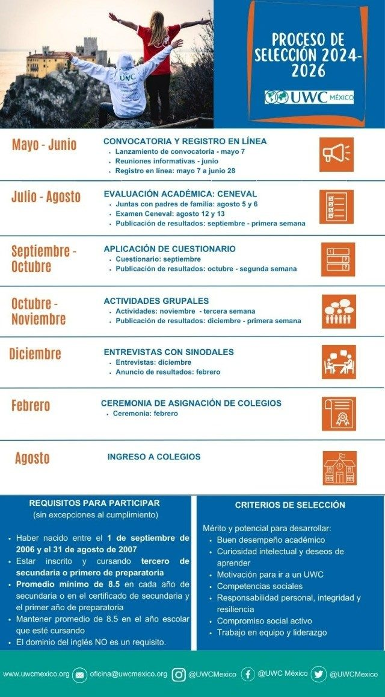

## Calendario

| Periodo | Etapa | Fechas |
| --- | --- | --- |
| Mayo – junio | **Convocatoria y registro en línea** | Lanzamiento de la convocatoria: 7 de mayo · Reuniones informativas: junio · Registro en línea: del 7 de mayo al 28 de junio |
| Julio – agosto | **Evaluación académica: Ceneval** | Juntas con padres de familia: 5 y 6 de agosto · Examen Ceneval: 12 y 13 de agosto · Publicación de resultados: primera semana de septiembre |
| Septiembre – octubre | **Aplicación del cuestionario** | Cuestionario: septiembre · Publicación de resultados: segunda semana de octubre |
| Octubre – noviembre | **Actividades grupales** | Actividades: tercera semana de noviembre · Publicación de resultados: primera semana de diciembre |
| Diciembre | **Entrevistas con sinodales** | Entrevistas: diciembre · Anuncio de resultados: febrero |
| Febrero | **Ceremonia de asignación de colegios** | Ceremonia: febrero |
| Agosto | **Ingreso a colegios** | |

Estas eran las fechas previstas al publicar el calendario. Las fechas definitivas de cada etapa se anunciaron en las notas informativas del proceso.

## Requisitos para participar (sin excepciones al cumplimiento)

- Haber nacido entre el **1 de septiembre de 2006 y el 31 de agosto de 2007**.
- Estar inscrit@ y cursando **tercero de secundaria o primero de preparatoria**.
- **Promedio mínimo de 8.5** en cada año de secundaria o en el certificado de secundaria y el primer año de preparatoria.
- Mantener promedio de 8.5 en el año escolar que esté cursando.
- El dominio del inglés **no** es un requisito.

## Criterios de selección

Mérito y potencial para desarrollar:

- Buen desempeño académico.
- Curiosidad intelectual y deseos de aprender.
- Motivación para ir a un UWC.
- Competencias sociales.
- Responsabilidad personal, integridad y resiliencia.
- Compromiso social activo.
- Trabajo en equipo y liderazgo.

