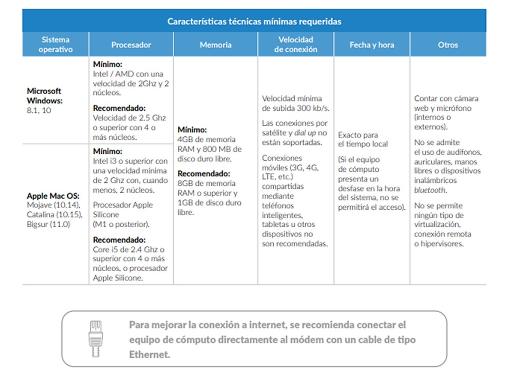

## Registro

1. El EXANI I se aplicará en su modalidad **Desde Casa el sábado 12 de agosto de 2023**.
2. Para presentar el **EXANI I** debes registrarte en línea en la página del Ceneval. **La dirección electrónica para el registro es:** [http://registroenlinea.ceneval.edu.mx/RegistroLinea/indexCerrado.php](http://registroenlinea.ceneval.edu.mx/RegistroLinea/indexCerrado.php)
3. El registro en línea estará abierto **únicamente del martes 11 al jueves 20 de julio de 2023**.
4. El registro es **muy sencillo** e indispensable para presentar el **EXANI I** en la modalidad en línea “Examen desde Casa”. Para que tu registro sea exitoso, **es muy importante que leas estas instrucciones detenidamente antes de intentar registrarte**.
5. Cuando entres a la liga que te proporcionamos arriba, en la primera pantalla debes ingresar los siguientes datos:
   - **Institución:** Asociación Mexicana pro Colegios del Mundo Unido, AC
   - **Matrícula:** es el dato que aparece a un lado de tu nombre en el listado de candidatos aceptados que publicamos el viernes (solo incluye los 4 últimos dígitos; por ejemplo, 0433).
   - **Programa / Carrera:** NUEVO EXANI I (única opción)
   - **Campus:** Asociación Mexicana pro Colegios del Mundo Unido, AC – Ciudad de México
6. En la segunda pantalla verás tu nombre **tal y como lo ingresaste al llenar el formulario** (como aparece en la lista de candidatos aceptados). Deberás ingresar una contraseña (que tiene que ser alfanumérica y contar al menos con cuatro caracteres). Es muy importante que **anotes esta contraseña en algún lugar de fácil acceso** y que la tengas a la mano a lo largo de esta etapa, ya que la vas a necesitar más adelante en el proceso.
7. En la tercera pantalla aparece de nueva cuenta tu nombre. En “opciones” aparece “**Editar su registro al examen**”. **Debes dar clic ahí para entrar al cuestionario.**
8. El cuestionario consta de varias secciones. La primera es sobre tus datos generales. La segunda es sobre la computadora que utilizarás en el Examen desde Casa e incluye una prueba para constatar que esa computadora cumple con los requerimientos mínimos que indicamos en la Nota 1 y que puedes encontrar más abajo.
9. El cuestionario incluye también un cuestionario de contexto. Es ***obligatorio*** que lo completes.
10. **Debes llenar el registro Ceneval en la misma computadora en la que realizarás el examen** para que la prueba sea válida. Toma tan solo unos minutos. Las secciones subsecuentes son sobre información general que solicita el Ceneval para sus estadísticas. Es necesario que **contestes todas las preguntas**; no podrás avanzar en el cuestionario si dejas cualquier pregunta en blanco.
11. La **dirección de correo electrónico** que ingreses debe ser la misma que ingresaste al llenar el formulario de registro al proceso de selección. El Ceneval enviará a esa dirección de correo los documentos y las claves para que puedas ingresar al Examen desde Casa, así que es muy importante que te asegures de ingresarla de forma correcta.
12. El llenado del cuestionario toma aproximadamente de **25 a 30 minutos**.
13. **Puedes guardar tus respuestas y reingresar más tarde** utilizando tu contraseña (ver el punto 6), pero lo ideal es que termines de responder el cuestionario en una sola sesión.

## Donativo

1. Como se indicó en la Nota 1, se requiere que realices un donativo **único de $250 (doscientos cincuenta) pesos**. Para cubrirlo puedes utilizar PayPal, hacer una **transferencia electrónica o un depósito en sucursal** a la siguiente cuenta:
   - Banco: **Citibanamex**
   - Titular: **Asociación Mexicana pro Colegios del Mundo Unido, A.C.**
   - Sucursal: **7003**
   - Número de cuenta: **4527340**
   - CLABE: **002180700345273406**

   Es necesario que envíes una imagen o escaneo del comprobante de tu donativo por correo electrónico a [oficina@uwcmexico.org](mailto:oficina@uwcmexico.org). **Es necesario que en el cuerpo del correo indiques tu nombre para que podamos registrarlo.**
2. Es requisito indispensable para tener derecho a examen cubrir el donativo **después de inscribirte al registro Ceneval y a más tardar el domingo 23 de julio**.
3. No podremos realizar reembolsos de los donativos en los casos de candidatos que realicen el donativo pero no se inscriban en el registro Ceneval.
4. Para quien no pueda cubrir el donativo, contamos con un número muy limitado de exenciones. Solo podrán ser consideradas las personas que escriban a [oficina@uwcmexico.org](mailto:oficina@uwcmexico.org) y argumenten las causas de fuerza mayor por las cuales no pueden cubrir dicha cantidad. La Asociación se reserva el derecho de aceptar o declinar dichas solicitudes.

## Espacio y equipo de cómputo para el examen en línea

Para presentar el examen deberás acondicionar un “espacio de aplicación” ya sea en tu domicilio, en tu escuela si estuviera abierta, o en el domicilio de algún familiar o amigo. Ahí debes colocar el equipo de cómputo, hacer los exámenes de práctica y, en la fecha indicada, presentar el examen.

Para ello tendrás que:

- Tener acceso a internet.
- Seleccionar un espacio preferentemente cerrado, silencioso y bien iluminado.
- Utilizar un asiento cómodo que, al estar sentad@, permita que la cámara del equipo de cómputo quede a la altura de tu rostro.
- Desalojar el espacio donde se encuentra el equipo de cómputo para evitar que haya libros, cuadernos o materiales que puedan ser considerados como apoyo indebido para realizar el examen.
- Ubicar la computadora en un escritorio o mesa rígida, preferentemente cercana al módem para reducir el riesgo de pérdida de conexión a internet.
- Conectar la computadora y el módem, de preferencia, a algún dispositivo de respaldo de energía eléctrica (*no break*) que provea energía regulada, en caso de algún corte en el suministro eléctrico.
- El equipo debe tener instalados (o se le deben poder instalar) los navegadores Chrome y/o Mozilla Firefox, y debe tener la posibilidad de instalar software.
- **El examen no se puede realizar utilizando tabletas electrónicas ni teléfonos inteligentes.**

### Muy importante: condiciones mínimas del equipo de cómputo

Por indicaciones del Ceneval, es obligatorio que cuentes con un equipo de cómputo funcional, ya sea de escritorio o portátil (*laptop*), con **cámara web (*webcam*) y micrófono** y las siguientes **características mínimas**:

**Si no tienes un equipo con estas características, aún estás a tiempo de conseguir uno con algún familiar o amigo para presentar el examen sin problemas.**

## Información adicional

- **A partir del viernes 6 de agosto de 2023**, los sustentantes que se hayan registrado correcta y oportunamente en el registro del Ceneval recibirán un correo electrónico en la dirección que ingresaron en el formulario inicial. En este correo se incluirá la información necesaria para presentar su examen: fecha y hora, folio, contraseña de ingreso, instructivo de aplicación, instrucciones para descargar el software seguro y los compromisos que adquieren al presentarlo.
- Asimismo, se te enviará información para que accedas a un **examen de práctica**, que se realizará el martes 8 de agosto de 2023.
- Necesitas **revisar todas las bandejas de tu correo**, ya que el correo del Ceneval pudiera llegar a la bandeja de spam, basura o correo no deseado. La dirección desde la que te lo van a enviar es examendesdecasa@ceneval.edu.mx.
- **Muy importante:** para tener derecho a examen, debes contar con el **folio y la contraseña que recibirás del Ceneval y con una identificación con fotografía reciente**. Sin ellos no podrás presentar el examen. Si no cuentas con una identificación, puedes pegar una foto reciente y de tamaño adecuado a tu acta de nacimiento o a tu certificado de secundaria y usarlo como identificación.
- **Por favor, regístrate cuanto antes.** Si lo dejas para el último día, el sistema puede estar saturado y rechazar tu registro.
- Al término del periodo de registro en línea publicaremos la **Nota 3** con información sobre las **juntas informativas** en línea.
- Te recordamos que para realizar tu registro en línea debes acceder a: [http://registroenlinea.ceneval.edu.mx/RegistroLinea/indexCerrado.php](http://registroenlinea.ceneval.edu.mx/RegistroLinea/indexCerrado.php)

**Si tienes dudas, lee de nuevo la nota. Y si después de hacerlo persisten, escribe a [oficina@uwcmexico.org](mailto:oficina@uwcmexico.org). Con gusto te apoyaremos para aclararlas. ¡Suerte!**
