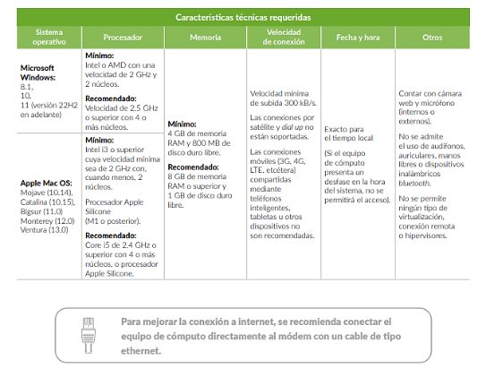

## Atención

1. **Toda la comunicación de UWC México con l@s candidat@s se hará a través de este sitio web. No enviaremos anuncios por correo electrónico ni por otro medio de comunicación. Ustedes tienen la responsabilidad de estar pendientes y revisar este sitio frecuentemente para enterarse de las actividades e indicaciones para las siguientes fases del proceso.**
2. **Todos los horarios que se mencionan en esta nota informativa se refieren al horario del centro de México.**

## Recuerda

- Ya debes haber recibido un correo del Ceneval con la información necesaria para presentar el examen. Revisa todas las bandejas del correo, incluido el correo no deseado (spam). Si no has recibido el correo, por favor escribe a [oficina@uwcmexico.org](mailto:oficina@uwcmexico.org).
- **Viernes 4 y miércoles 9 de agosto:** examen de práctica (**obligatorio**) en un horario entre las 9:00 y las 12:00 horas.
- **Sábado 12 de agosto:** examen EXANI I de 9:00 a 13:30 horas (abre el navegador seguro 10 minutos antes de que inicie el examen).

## Para poder presentar el examen (de práctica y real) debes contar con lo siguiente

- **El folio y la contraseña que recibiste del Ceneval.**
- **Equipo de cómputo con las características que les hemos comunicado previamente y que se repiten abajo.**
- **Haber presentado el examen de práctica.**
- **Una identificación con fotografía reciente.** Ejemplos: credencial de la escuela, pasaporte, acta de nacimiento con fotografía reciente pegada o credencial de elector de uno de tus padres.
- **Haber aportado el donativo y enviado el comprobante correspondiente.**

<strong>Si no cumples con alguno de los puntos anteriores, no podrás presentar el examen.</strong>

Estas son las características técnicas que debe cumplir tu equipo para poder presentar el examen:

## Mesa de soporte técnico

Estaremos para apoyarte durante el examen de práctica y el examen real en los siguientes teléfonos: **55 2847 7925 y 55 1732 6317**.

La comunicación con nosotros durante el examen será únicamente vía mensaje de WhatsApp. Estos teléfonos **únicamente** estarán disponibles para dar soporte técnico durante los exámenes y estarán habilitados el viernes 4, el miércoles 9 y el sábado 12 de agosto.

## Preparación para el examen

Usa la guía interactiva del EXANI I, disponible en el sitio del Ceneval.

Si quieres consultar la presentación que usamos en las sesiones informativas, [consúltala aquí (PDF)](https://uwcmexico.org/wp-content/uploads/2023/08/UWC_Mexico.PresentacionJUNTAINFORMATIVACENVAL08-2023.pdf).

## Dudas

Finalmente, un favor: si tienes dudas sobre estas indicaciones, **vuelve a leer las notas que hemos publicado una, dos o hasta tres veces**. Si las dudas persisten, claro que estamos para ayudar. Usa para ello el correo [oficina@uwcmexico.org](mailto:oficina@uwcmexico.org).

¡Y revisa frecuentemente este mismo sitio web! Recuerda que es la vía de comunicación que usaremos para mantenerte informad@ durante todo el proceso de selección.
