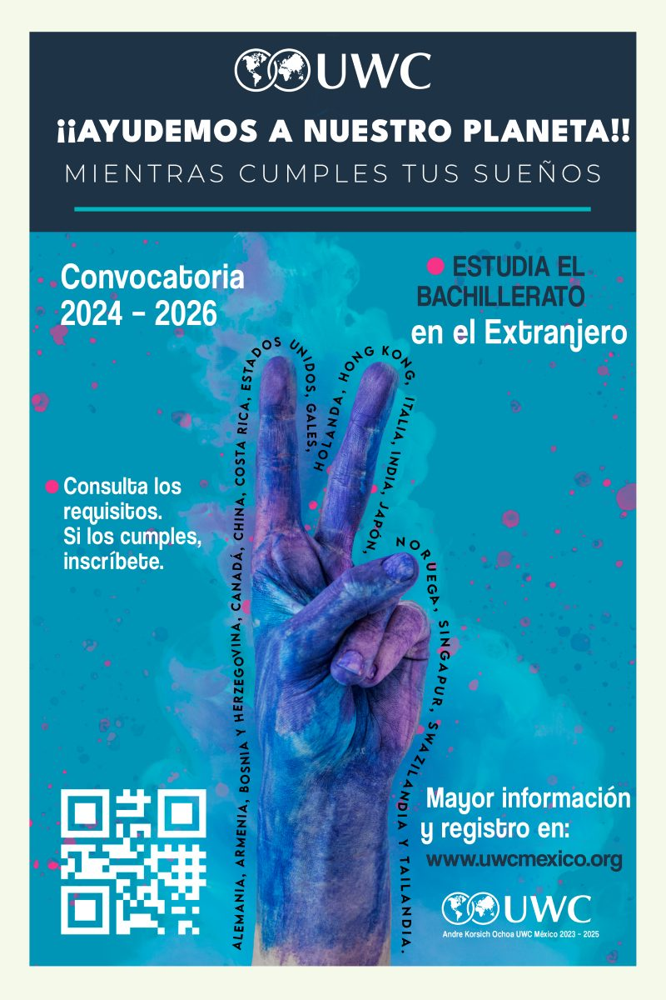

**¡¡Ayudemos a nuestro planeta!! Mientras cumples tus sueños.**

Convocatoria 2024–2026: estudia el bachillerato en el extranjero, en colegios UWC de Alemania, Armenia, Bosnia y Herzegovina, Canadá, China, Costa Rica, Estados Unidos, Gales, Holanda, Hong Kong, Italia, India, Japón, Noruega, Singapur, Suazilandia y Tailandia.

Consulta los requisitos. Si los cumples, inscríbete. Mayor información y registro en www.uwcmexico.org.

