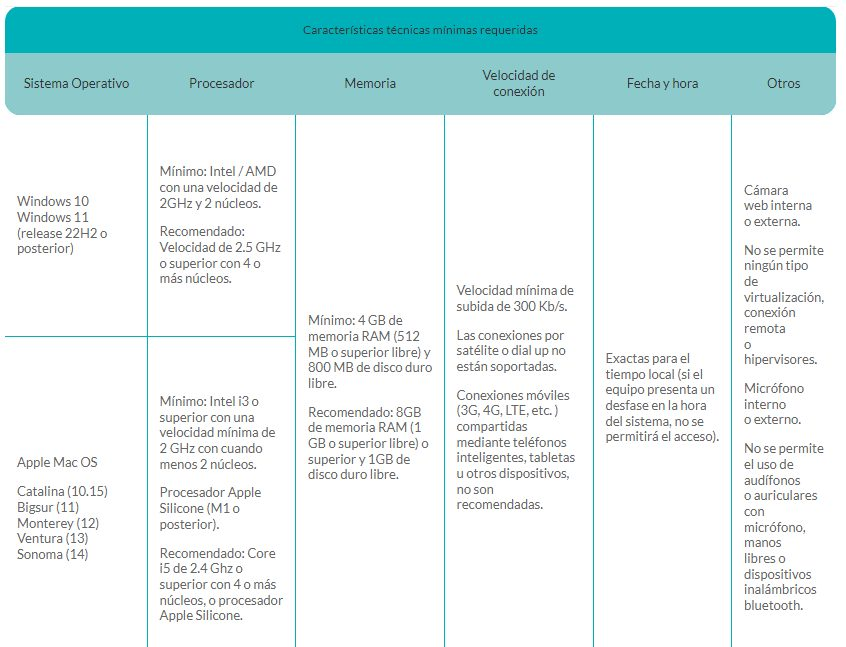

## Atención

1. **Toda la comunicación de UWC México con lxs candidatxs se hará a través de este sitio web. No enviaremos anuncios por correo electrónico ni por otro medio de comunicación. Ustedes tienen la responsabilidad de estar pendientes y revisar este sitio frecuentemente para enterarse de las actividades e indicaciones que requieran para las siguientes fases del proceso.**
2. En cualquier comunicación que tengan con UWC México (envío de documentos, etcétera) deben incluir su nombre completo y su número de matrícula UWC (el que les asignamos cuando se registraron a este proceso de selección; **no** es lo mismo que el número de folio del Ceneval).
3. Todos los horarios que se mencionan en esta nota informativa se refieren al horario del centro de México.

## Registro para el examen Ceneval

El registro para presentar el examen Ceneval ya está cerrado. Lxs candidatxs que cumplieron con este proceso ya deben contar con un pase de ingreso al examen.

Estxs candidatxs tendrán que asistir a **una junta informativa, exámenes de práctica y una sesión de aplicación del examen Ceneval**. Quien **no** se haya registrado ante el Ceneval, por favor no asista a la junta ni al examen, ya que no habrá manera de que lo pueda presentar.

Como se informó previamente, tanto la junta informativa como los exámenes de práctica y el examen real se llevarán a cabo **en línea**.

## Sesión informativa

Organizamos esta junta informativa para hablar de temas relacionados con los Colegios del Mundo Unido y UWC México, pero, sobre todo, ***para darles información importante sobre el examen Ceneval*** que estarán presentando próximamente. También resolveremos las dudas que puedan tener nuestrxs candidatxs o sus familias.

***La asistencia a la sesión informativa es obligatoria para lxs candidatxs.*** También pueden estar presentes tu madre, padre y/o tutores, pero cada candidatx solo podrá ingresar a la reunión con un máximo de dos equipos de cómputo.

La junta informativa se realizará de manera virtual, vía la **plataforma Zoom, el sábado 10 de agosto, de 9:30 a 11:30 horas** (hora de la Ciudad de México).

La liga se envió por correo.

## Examen Ceneval: preparación

**Pase de ingreso:** si desean reimprimir su pase de ingreso para estar tranquilos de que el examen se realizará desde casa, pueden hacerlo, pero no es indispensable.

**Entre el lunes 12 y el miércoles 14 de agosto**, lxs sustentantes que se hayan registrado correctamente para presentar el examen **recibirán un correo electrónico del Ceneval**. Este correo tendrá la información necesaria para que puedan presentar su examen: fecha y hora, folio, contraseña para ingresar al examen y el instructivo de aplicación para el sustentante. (Es posible que en el correo y en el pase de ingreso aparezca un domicilio como sede del examen; esto tiene que ver con la configuración del sistema del Ceneval. Sin embargo, **el examen será en línea**).

En ese mismo correo se les comunicará la información necesaria para que puedan hacer el **examen de práctica**.

**Muy importante:** necesitan **revisar todas las bandejas de su correo**, ya que el correo del Ceneval pudiera llegar a la bandeja de spam, basura o correo no deseado. La dirección desde la que se los van a enviar es examendesdecasa@ceneval.edu.mx.

En caso de que para el **jueves 15 de agosto** no hayan recibido dicho correo, por favor escriban a [oficina@uwcmexico.org](mailto:oficina@uwcmexico.org) avisando de esta situación.

### Condiciones mínimas del equipo de cómputo

Por indicaciones del Ceneval, es obligatorio que cuenten con un equipo de cómputo funcional, ya sea de escritorio o portátil (*laptop*). Les sugerimos que revisen las características del equipo de cómputo que piensan usar para presentar el examen. **Si no tienen un equipo con estas características, aún están a tiempo de conseguir uno con algún familiar o amigo.**

El equipo debe tener **cámara web (*webcam*) y micrófono**, así como las **características mínimas** que se indican en este cuadro:

### Derecho a examen

Para poder presentar el examen, deben contar con lo siguiente:

- El **folio** y la **contraseña** que recibirán del Ceneval.
- **Haber presentado el examen de práctica.**
- **Tener una identificación con fotografía.** Algunos ejemplos: credencial de la escuela, del IMSS o del ISSSTE, constancia de estudios con foto reciente, pasaporte o alguna otra similar.
- **Haber aportado el donativo y enviado el comprobante correspondiente a [oficina@uwcmexico.org](mailto:oficina@uwcmexico.org).** Recuerden que, para quien no pueda cubrir el donativo, **contamos con un número muy limitado de exenciones**. Si requieres que te consideremos, escribe a [oficina@uwcmexico.org](mailto:oficina@uwcmexico.org) y argumenta las causas de fuerza mayor por las cuales no puedes cubrir dicha cantidad. Te enviaremos un correo electrónico en el que te diremos si tu solicitud de exención fue aceptada. La Asociación se reserva el derecho de aceptar o declinar las solicitudes que reciba.

<strong>Si no cumplen con lo anterior, no podrán presentar el examen.</strong>

- **Guía interactiva del EXANI I:** en esta liga podrás prepararte para el examen del Ceneval: [Guía para el sustentante del EXANI I](https://online.flippingbook.com/view/662760219/).
- **Verificación del equipo de cómputo y navegador seguro:** ***antes de presentar el examen deberán verificar que el equipo de cómputo*** que usarán sea adecuado y descargar en su computadora el navegador seguro del Ceneval. En la sesión informativa les daremos las instrucciones para hacerlo y resolveremos sus dudas sobre este tema.

## Aplicación del examen

El **sábado 24 de agosto** se aplicará el examen EXANI I bajo la modalidad **Examen desde Casa; es decir, será un examen en línea**.

Para presentar su examen, lxs candidatxs **deberán ingresar a la plataforma del examen a las 9:00 horas para preparar lo necesario, iniciar en punto de las 9:30 horas y terminar a más tardar a las 13:30 horas**.

## Exámenes de práctica en línea

**El viernes 16 y el miércoles 21 de agosto** se llevarán a cabo los exámenes de práctica para todxs lxs sustentantes. Se podrán realizar a cualquier hora **entre las 9:00 y las 12:00 horas**.

Quien no presente el examen de práctica <strong>no tendrá derecho a presentar el examen real</strong>.

## Donativo y comprobante

Como se indicó en las Notas 1 y 2, lxs candidatxs que van a presentar el examen Ceneval deben haber realizado ya un donativo **único de $250 (doscientos cincuenta) pesos**. Es necesario que envíen una foto o escaneo del comprobante del depósito o transferencia a [oficina@uwcmexico.org](mailto:oficina@uwcmexico.org). Es requisito indispensable para tener derecho a examen cubrir el donativo; lxs candidatxs tienen hasta el **viernes 9 de agosto** para enviar su comprobante.

## Certificados de secundaria

Quienes terminaron la secundaria este año (2024) ya deben tener su **certificado de secundaria**. Es necesario que envíen este documento a [oficina@uwcmexico.org](mailto:oficina@uwcmexico.org). **Si no lo han hecho, tienen hasta el viernes 4 de agosto para enviarlo. De lo contrario, no podrán presentar el examen.**

## Dudas

Si tienes cualquier problema o pregunta, ***lee esta nota de nuevo***. Si después de releerla sigues teniendo la duda, escribe a [oficina@uwcmexico.org](mailto:oficina@uwcmexico.org). Dependiendo de la afluencia de mensajes que recibamos, nos podría tomar algunos días responderte, pero **con gusto te apoyaremos para aclararlas**.

**Finalmente, recuerden estar atentxs a nuestras siguientes notas informativas, que publicaremos en este mismo sitio web. Esta es la vía de comunicación que usaremos para informarles sobre el proceso de selección. Por eso es muy importante que a partir de ahora revisen frecuentemente nuestro sitio.**
