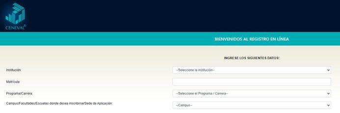

## Registro en línea para presentar el examen del Ceneval

El registro es muy sencillo e **indispensable** para presentar el EXANI I en la modalidad en línea “Examen desde Casa”, que es la que aplicaremos en esta convocatoria.

<strong>Es muy importante que leas estas instrucciones detenidamente antes de intentar registrarte</strong>, a fin de que este proceso sea más sencillo para ti.

1. El **EXANI I** se aplicará en su modalidad **Desde Casa** el **sábado 29 de agosto de 2026, de 9:00 a 13:30 horas** (horario de la Ciudad de México).
2. Para presentar el EXANI I debes registrarte en línea en la página del Ceneval. **La dirección electrónica para el registro es:** [http://registroenlinea.ceneval.edu.mx/RegistroLinea/indexCerrado.php](http://registroenlinea.ceneval.edu.mx/RegistroLinea/indexCerrado.php)
3. El registro en línea estará abierto **únicamente del martes 27 de julio al jueves 6 de agosto de 2026**.
4. Cuando entres a la liga que te proporcionamos arriba, verás la siguiente pantalla:

   

5. Ingresa los siguientes datos:
   - **Institución:** Asociación Mexicana pro Colegios del Mundo Unido, AC
   - **Matrícula:** es el dato que aparece a un lado de tu nombre en la lista de candidatos aceptados que publicamos la semana pasada (la matrícula está formada por “2729” y 3 dígitos; por ejemplo, 499).
   - **Programa / Carrera:** EXANI I (única opción)
   - **Campus:** Asociación Mexicana pro Colegios del Mundo Unido, AC – Ciudad de México
   - **Revisa el aviso de privacidad simplificado y acéptalo** si estás de acuerdo con su contenido.
6. En la segunda pantalla verás tu nombre **tal y como lo ingresaste al llenar el formulario** (como aparece en la lista de candidatos aceptados). Deberás crear una contraseña e ingresarla (tiene que ser alfanumérica y contar al menos con cuatro caracteres). Es muy importante que **anotes esta contraseña en algún lugar de fácil acceso** y que la tengas a la mano a lo largo de esta etapa del proceso, ya que la vas a necesitar más adelante.
7. En la tercera pantalla aparece de nueva cuenta tu nombre. En “opciones” aparece “**Editar su registro al examen**”. **Debes dar clic ahí para entrar al cuestionario.**
8. El cuestionario consta de **varias secciones**:
   - La primera es sobre tus datos generales, incluida tu CURP (si no cuentas con ella, consúltala en [https://www.gob.mx/curp/](https://www.gob.mx/curp/)).
   - La segunda sección es sobre la computadora que utilizarás en el Examen Desde Casa e incluye una prueba para constatar que esa computadora cumple con los requerimientos mínimos que indicamos en la Nota 1 y que puedes encontrar más abajo. **Debes llenar el registro Ceneval en la misma computadora en la que realizarás el examen** para que la prueba sea válida. Toma tan solo unos minutos.
9. El cuestionario incluye también un cuestionario de contexto. ***Es obligatorio que lo completes.***
10. En las siguientes secciones te pedirán información general que requiere el Ceneval para sus estadísticas. Es necesario que **contestes todas las preguntas**; no podrás avanzar en el cuestionario si dejas alguna en blanco.
11. La dirección de correo electrónico que uses en todo el proceso de selección debe ser la misma que ingresaste al llenar el formulario de registro al proceso de selección. **El Ceneval enviará a esa dirección de correo los documentos y las claves para que puedas ingresar al Examen desde Casa**, así que es muy importante que te asegures de ingresarla de forma correcta.
12. El llenado del cuestionario toma aproximadamente de **25 a 30 minutos**. Es obligatorio completarlo.
13. Puedes **guardar tus respuestas y continuar más tarde** utilizando tu contraseña (ver el punto 6), pero lo ideal es que termines de responder el cuestionario en una sola sesión.

<strong>Atención: llena el registro una sola vez.</strong> Si hubiera un registro duplicado, se dará de baja a la persona que se haya registrado dos veces.

## Donativo

1. Como se indicó en la [Nota 1](/avisos/2027-2029-nota-1-candidatos-aceptados/), se requiere que realices un donativo **único** que corresponde a tu derecho de examen.
2. **Puedes realizar este donativo vía PayPal** en la siguiente liga: [https://uwcmexico.org/donar-con-paypal/](https://uwcmexico.org/donar-con-paypal/), o bien **mediante transferencia electrónica o un depósito en sucursal** a la siguiente cuenta:
   - Banco: **Citibanamex**
   - Titular: **Asociación Mexicana pro Colegios del Mundo Unido, A.C.**
   - Sucursal: **7003**
   - Número de cuenta: **4527340**
   - CLABE: **002180700345273406**

   Es necesario que envíes una imagen o escaneo del comprobante de tu donativo por correo electrónico a [oficina@uwcmexico.org](mailto:oficina@uwcmexico.org). ***Es muy importante que en el cuerpo del correo indiques tu nombre y número de matrícula para que podamos registrarlo.***
3. Es requisito indispensable para tener derecho a examen cubrir el donativo y enviar el comprobante **después de inscribirte al registro Ceneval y a más tardar el jueves 6 de agosto**.
4. No podremos realizar reembolsos de los donativos en los casos de candidatos que realicen el donativo pero no se inscriban en el registro Ceneval o no se presenten al examen.
5. Para quien no pueda cubrir el donativo, **contamos con un número muy limitado de exenciones.** Si requieres que te consideremos, escribe a [oficina@uwcmexico.org](mailto:oficina@uwcmexico.org) y argumenta las causas de fuerza mayor por las cuales no puedes cubrir dicha cantidad. Te enviaremos un correo electrónico en el que te diremos si tu solicitud de exención fue aceptada. La Asociación se reserva el derecho de aceptar o declinar las solicitudes que reciba.

## Espacio físico y equipo de cómputo para el examen en línea

Para presentar el examen deberás acondicionar un “espacio de aplicación” ya sea en tu domicilio, en tu escuela si estuviera abierta, o en el domicilio de algún familiar o amigo. Ahí debes colocar el equipo de cómputo, hacer los exámenes de práctica y, en la fecha indicada, presentar el examen.

Algunos elementos que debes tener en cuenta para acondicionar este espacio:

- Tener acceso a internet.
- Seleccionar un espacio preferentemente cerrado, silencioso y bien iluminado.
- Utilizar un asiento cómodo que, al estar sentadx, permita que la cámara del equipo de cómputo quede a la altura de tu rostro.
- Desalojar el espacio donde se encuentra el equipo de cómputo para evitar que haya libros, cuadernos o materiales que puedan ser considerados como apoyo indebido para realizar el examen.
- Ubicar la computadora en un escritorio o mesa rígida, preferentemente cercana al módem para reducir el riesgo de pérdida de conexión a internet.
- Conectar la computadora y el módem, de preferencia, a algún dispositivo de respaldo de energía eléctrica (*no break*) que provea energía regulada, en caso de algún corte en el suministro eléctrico.
- El equipo debe tener instalados (o se le deben poder instalar) los navegadores Chrome y/o Mozilla Firefox.
- El equipo debe tener la posibilidad de instalar software.
- **El examen no se puede realizar utilizando tabletas electrónicas ni teléfonos inteligentes.**

### Muy importante: condiciones mínimas del equipo de cómputo

Por indicaciones del Ceneval, es obligatorio que cuentes con un equipo de cómputo funcional, ya sea de escritorio o portátil (*laptop*), con **cámara web (*webcam*) y micrófono** y las siguientes **características técnicas mínimas**:

- **Sistema operativo:** Windows 10 (64 bits) o Windows 11 versión 22H2 o posterior (64 bits); o Apple macOS v.11 Big Sur, v.12 Monterey, v.13 Ventura, v.14 Sonoma o v.15 Sequoia.
- **Procesador (Windows):** mínimo Intel o AMD de 2 GHz y dos núcleos; recomendado Intel o AMD de 2.5 GHz o superior y cuatro núcleos o más.
- **Procesador (Mac):** mínimo Intel i3 o superior de 2 GHz y dos núcleos, o procesador Apple Silicon (M1 o posterior); recomendado Core i5 de 2.4 GHz o superior y cuatro núcleos o más, o procesador Apple Silicon.
- **Memoria:** mínimo 4 GB de RAM (512 MB o más libres) y 800 MB de disco duro libre; recomendado 8 GB de RAM (1 GB o más libre) y 1 GB de disco duro libre.
- **Conexión:** velocidad mínima de subida de 300 kB/s. Las conexiones por internet satelital y *dial up* no están soportadas. Las conexiones móviles (3G, 4G, LTE, etcétera) compartidas mediante teléfonos inteligentes, tabletas u otros dispositivos no son recomendadas.
- **Fecha y hora:** exactas para el tiempo local. Si el equipo presenta un desfase en la hora del sistema, no se permitirá el acceso.
- **Otros:** cámara web interna o externa y micrófono interno o externo. No se permite ningún tipo de virtualización, conexión remota o hipervisores, ni el uso de audífonos o auriculares con micrófono, manos libres o dispositivos inalámbricos *bluetooth*.

Al recibir esta nota informativa, te sugerimos que revises las características del equipo de cómputo que piensas usar para presentar el examen. **Si no tienes un equipo con estas características, aún estás a tiempo de conseguir uno con algún familiar o amigo.** Recuerda que no es posible presentar el examen en una computadora que no tenga esas características.

## Después de tu registro: correo del Ceneval y examen de práctica

**A partir del 19 de agosto de 2026**, lxs candidatxs que se hayan registrado correcta y oportunamente en el registro del Ceneval recibirán un correo electrónico en la dirección que ingresaron en el formulario inicial. En este correo se incluirá la información necesaria para presentar su examen: fecha y hora, folio, contraseña de ingreso, instructivo de aplicación, instrucciones para descargar el software seguro y los compromisos que adquieren al presentarlo.

**Nota:** en el correo que recibas probablemente aparecerá una dirección en la Ciudad de México como sede del examen. No te preocupes: **el examen no será en esa ubicación, sino en línea**, como ya lo hemos mencionado.

Asimismo, se te enviará información para que accedas al **examen de práctica**, que se realizará el **viernes 21 de agosto de 2026, de 9:00 a 12:00 horas**.

Necesitas **revisar todas las bandejas de tu correo**, ya que el correo del Ceneval pudiera llegar a la bandeja de spam, basura o correo no deseado. La dirección desde la que te lo van a enviar es examendesdecasa@ceneval.edu.mx.

<strong>Muy importante:</strong> para tener derecho a examen, debes contar con el <strong>folio</strong> y la <strong>contraseña</strong> que recibirás del Ceneval y con una <strong>identificación con fotografía reciente</strong>. Sin ellos no podrás presentar el examen. Si no cuentas con una identificación, puedes pegar una foto reciente y de tamaño adecuado a tu acta de nacimiento o a tu certificado de secundaria y usarlo como identificación.

**Por favor, regístrate cuanto antes.** Si lo dejas para el último día, el sistema puede estar saturado y rechazar tu registro.

## Sesiones informativas

Tendremos **sesiones informativas virtuales** para lxs candidatxs y sus madres y padres de familia. Se realizarán el **sábado 15 y el domingo 16 de agosto, de 9:00 a 11:00 (hora de la Ciudad de México)**. Cuando termine el periodo de registro en línea publicaremos en este sitio la Nota 3 con información sobre esta sesión.

Te recordamos que para realizar tu registro en línea debes acceder a: [http://registroenlinea.ceneval.edu.mx/RegistroLinea/indexCerrado.php](http://registroenlinea.ceneval.edu.mx/RegistroLinea/indexCerrado.php)

## ¿Dudas?

Si tienes cualquier problema o pregunta, ***lee esta nota de nuevo***. Y si después de hacerlo sigues teniendo la duda, escribe a [oficina@uwcmexico.org](mailto:oficina@uwcmexico.org). Dependiendo de la afluencia de mensajes que recibamos, nos podría tomar algunos días responderte, pero **con gusto te apoyaremos para aclararlas**.

Finalmente, recuerda que nuestro sitio web es el canal por medio del cual te estaremos dando la información relacionada con este proceso de selección, así que ahí es donde debes buscar nuestras actualizaciones e indicaciones.
